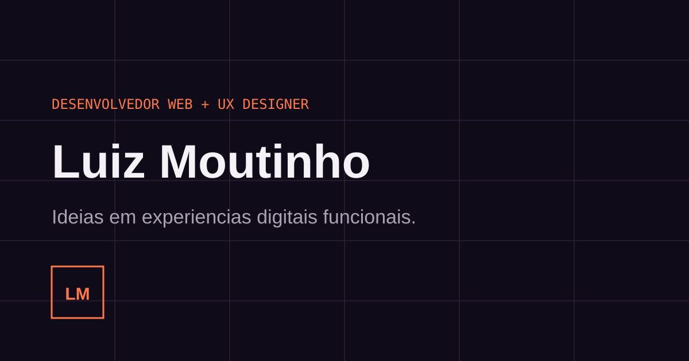

# Portfolio Luiz Moutinho

Portfolio profissional de Luiz Moutinho, Desenvolvedor Web e UX Designer. A SPA apresenta projetos verificados no workspace, estudos de caso, processo, competencias, formacao e contato.



## Funcionalidades

- Navegacao responsiva com indicacao de secao
- Seis projetos em destaque renderizados por dados
- Estudos de caso acessiveis em dialogos
- Projetos adicionais, processo, competencias e formacao
- Copia de e-mail, `mailto`, WhatsApp e GitHub
- SEO, Open Graph, dados estruturados, sitemap e robots
- Respeito a `prefers-reduced-motion`

## Tecnologias

Vite, React 19, TypeScript, CSS, Lucide, Vitest, Testing Library e ESLint.

## Estrutura

```text
src/data/projects.ts   conteudo dos projetos
src/App.tsx            componentes e secoes
src/styles.css         identidade e responsividade
docs/                  inventario, fontes e decisoes
public/                imagens e arquivos de SEO
```

## Executar e validar

```bash
npm install
npm run dev
npm run type-check
npm run lint
npm run test
npm run check:links
npm run build
```

O build fica em `dist/`. `vite.config.ts` usa `/portfolio-luiz-moutinho/` no GitHub Actions e `/` localmente.

## Publicacao

1. Crie o repositorio `portfolio-luiz-moutinho` no GitHub.
2. Envie a branch `main`.
3. Em **Settings > Pages**, selecione **GitHub Actions**.
4. O workflow `.github/workflows/deploy.yml` valida tipos, lint, testes e build antes do deploy.

## Atualizacao de conteudo

- Edite projetos em `src/data/projects.ts`.
- Substitua imagens em `public/images/` e atualize `image`/`imageAlt`.
- Edite contato em `src/App.tsx` e os metadados em `index.html`.
- Uma foto profissional pode substituir o bloco visual do hero; nenhuma foto pessoal adequada foi encontrada no workspace.

## Decisoes e fontes

Veja `docs/project-inventory.md`, `docs/content-sources.md` e `docs/ux-decisions.md`. O inventario consolidou copias relacionadas e omitiu credenciais, bancos, dependencias e builds.

## Limitacoes

- Nem todos os projetos puderam ser executados: alguns exigem banco, Docker ou configuracao privada.
- Nao foram confirmadas URLs publicas para todos os trabalhos.
- O Google Fonts possui fallback local; para isolamento total, as fontes podem ser hospedadas no proprio projeto.
